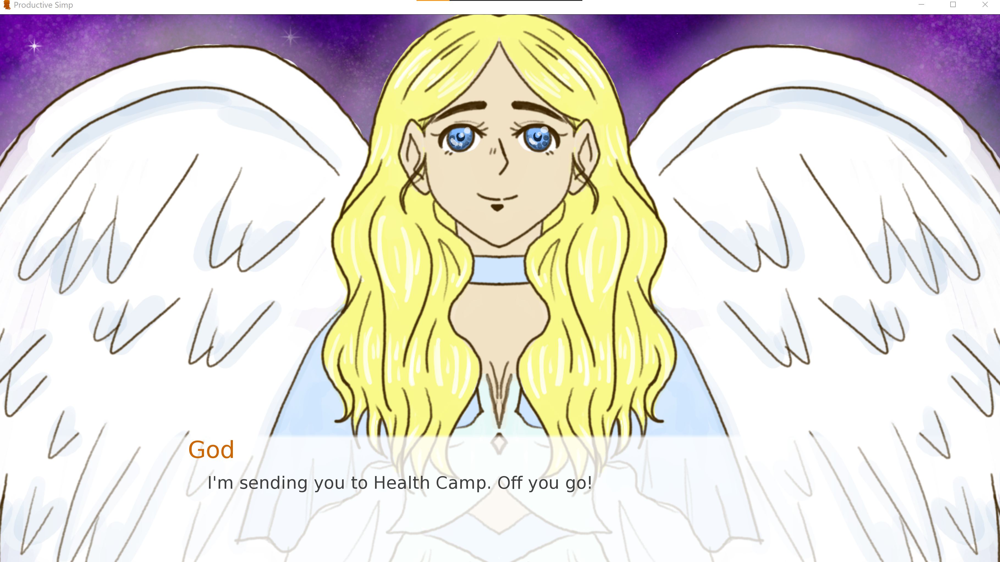

# Self-Care Sim(p)
## Team: We Write Code Not Tragedies   

 
Yan Aigiarn Cheuk   
Niels Mainville  
Ojetta Ye   
Angela Zhu   

 

## A Training Arc That Hits Different...
Your next life was destined to be great, splendid. You were supposed to do great things ... to go down in history ... to save the world! But God takes one look at your sorry state of being and decides to send you to Health Camp, where you must acquire healthy habits if you ever want to leave and live.     
## The Game 
Self-Care Sim(p) is a visual novel designed to help you maintain healthy habits such as a regular sleep schedule, good nutrition habits, appropriate hydration, general fitness, and a thriving social life. There are five camp counselors, each in charge of one good habit. The player must stay on the good side of all the counselors, by practicing the aforementioned habits, and earn their badges of approval. Only after obtaining all five badges can they leave the camp, and proceed to their next life where they will be able to fulfill their role as a hero. 
  
 
 

 
 

*Written with Ren'Py*  
*Character artwork by Aigiarn with Krita  *
*Background artwork by Angela with Blender and Krita  * 
*Music by Ojetta* 

